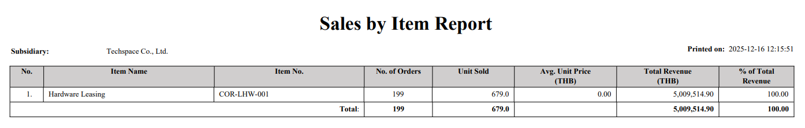
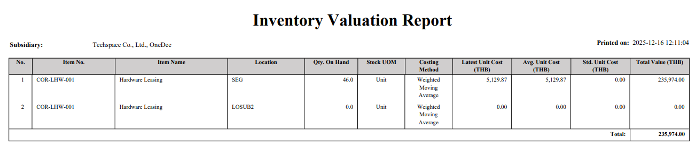

**1. Sale By Item**

```sql
SELECT ICMMR.id AS ICMMR_id,
       ICMMR.item_no AS ICMMR_item_no,
       ICMMR.name AS ICMMR_name,
       SUM(OEOEL.qty_ord) AS unit_sold,
       COUNT(DISTINCT OEOEL.order_id) AS order_count,
       SUM(OEOEL.line_net) AS total_rev,
       COALESCE(SUM(OEOEL.line_net), 0) * 100.0 / NULLIF(SUM(SUM(OEOEL.line_net)) OVER (), 0) AS p_total_rev
FROM ICMMR
INNER JOIN OEOEL ON ICMMR.id = OEOEL.item_id
LEFT JOIN OEOEH ON OEOEL.order_id = OEOEH.id
WHERE ICMMR.id IN
    (SELECT trans_id
     FROM SMSUBSIDIARYENTITY
     WHERE sub_id IN (1)
       AND trans_type = 3)
     AND (ICMMR.creator = 79 OR ICMMR.assign2 = 79)
GROUP BY ICMMR.id,
         ICMMR.item_no,
         ICMMR.name
ORDER BY SUM(OEOEL.line_net) DESC
```

This report summarizes sales data by area.


**2. Inventory Valution**

```sql
SELECT ICMMRSTOCK.id AS ICMMRSTOCK_id,
       ICMMRSTOCK.item_id AS ICMMRSTOCK_item_id,
       ICMMRSTOCK.item_no AS ICMMRSTOCK_item_no,
       ICMMRSTOCK.loc_id AS ICMMRSTOCK_loc_id,
       ICMMRSTOCK.loc_code AS ICMMRSTOCK_loc_code,
       ICMMRSTOCK.qty AS ICMMRSTOCK_qty,
       ICMMRSTOCK.qty_shp AS ICMMRSTOCK_qty_shp,
       ICMMRSTOCK.qty_rcp AS ICMMRSTOCK_qty_rcp,
       ICMMRSTOCK.qty_adj AS ICMMRSTOCK_qty_adj,
       ICMMRSTOCK.total_cost AS ICMMRSTOCK_total_cost,
       ICMMRSTOCK.std_cost AS ICMMRSTOCK_std_cost,
       ICMMRSTOCK.mrc_cost AS ICMMRSTOCK_mrc_cost,
       ICMMRSTOCK.avg_cost AS ICMMRSTOCK_avg_cost,
       ICMMRSTOCK.last_cost AS ICMMRSTOCK_last_cost,
       ICMMRSTOCK.created AS ICMMRSTOCK_created,
       ICMMRSTOCK.updated AS ICMMRSTOCK_updated,
       ICMMR.id AS ICMMR_id,
       ICMMR.item_no AS ICMMR_item_no,
       ICMMR.status AS ICMMR_status,
       ICMMR.item_class AS ICMMR_item_class,
       ICMMR.ven_specific AS ICMMR_ven_specific,
       ICMMR.name AS ICMMR_name,
       ICMMR.category AS ICMMR_category,
       ICMMR.ofc_id AS ICMMR_ofc_id,
       ICMMR.ic_acc_set_id AS ICMMR_ic_acc_set_id,
       ICMMR.specific_cost AS ICMMR_specific_cost,
       ICMMR.tax_list AS ICMMR_tax_list,
       ICMMR.price_id_list AS ICMMR_price_id_list,
       ICMMR.gtin AS ICMMR_gtin,
       ICMMR.model_no AS ICMMR_model_no,
       ICMMR.backorder AS ICMMR_backorder,
       ICMMR.weight AS ICMMR_weight,
       ICMMR.wt_uom_id AS ICMMR_wt_uom_id,
       ICMMR.is_lot AS ICMMR_is_lot,
       ICMMR.is_serl AS ICMMR_is_serl,
       ICMMR.is_sales_track AS ICMMR_is_sales_track,
       ICMMR.is_web AS ICMMR_is_web,
       ICMMR.is_shelf AS ICMMR_is_shelf,
       ICMMR.is_wty AS ICMMR_is_wty,
       ICMMR.is_cmpt_track AS ICMMR_is_cmpt_track,
       ICMMR.lot_prefix AS ICMMR_lot_prefix,
       ICMMR.lot_next AS ICMMR_lot_next,
       ICMMR.serl_prefix AS ICMMR_serl_prefix,
       ICMMR.serl_next AS ICMMR_serl_next,
       ICMMR.shelf_val AS ICMMR_shelf_val,
       ICMMR.shelf_period AS ICMMR_shelf_period,
       ICMMR.shelf_start AS ICMMR_shelf_start,
       ICMMR.wty_val AS ICMMR_wty_val,
       ICMMR.wty_period AS ICMMR_wty_period,
       ICMMR.wty_start AS ICMMR_wty_start,
       ICMMR.alt_item AS ICMMR_alt_item,
       ICMMR.min_sales_qty AS ICMMR_min_sales_qty,
       ICMMR.pick_seq AS ICMMR_pick_seq,
       ICMMR.description AS ICMMR_description,
       ICMMR.x_oe_desc AS ICMMR_x_oe_desc,
       ICMMR.x_po_desc AS ICMMR_x_po_desc,
       ICMMR.old_desc AS ICMMR_old_desc,
       ICMMR.assign2 AS ICMMR_assign2,
       ICMMR.creator AS ICMMR_creator,
       ICMMR.created AS ICMMR_created,
       ICMMR.updated AS ICMMR_updated,
       ICACCSET.id AS ICACCSET_id,
       ICACCSET.ac_set_code AS ICACCSET_ac_set_code,
       ICACCSET.description AS ICACCSET_description,
       ICACCSET.costing_mtd AS ICACCSET_costing_mtd,
       ICACCSET.status AS ICACCSET_status,
       ICACCSET.created AS ICACCSET_created,
       ICACCSET.updated AS ICACCSET_updated,
       ICMMRUOM.id AS ICMMRUOM_id,
       ICMMRUOM.status AS ICMMRUOM_status,
       ICMMRUOM.item_id AS ICMMRUOM_item_id,
       ICMMRUOM.uom AS ICMMRUOM_uom,
       ICMMRUOM.factor AS ICMMRUOM_factor,
       ICMMRUOM.stock_uom AS ICMMRUOM_stock_uom,
       ICMMRUOM.dimension AS ICMMRUOM_dimension,
       ICMMRUOM.created AS ICMMRUOM_created,
       ICMMRUOM.updated AS ICMMRUOM_updated
FROM ICMMRSTOCK
LEFT JOIN ICMMR ON ICMMRSTOCK.item_id = ICMMR.id
LEFT JOIN ICACCSET ON ICMMR.ic_acc_set_id = ICACCSET.id
LEFT JOIN ICMMRUOM ON ICMMRSTOCK.item_id = ICMMRUOM.item_id
WHERE ICMMRUOM.stock_uom = 'y'
  AND ICMMRSTOCK.item_id IN
    (SELECT trans_id
     FROM SMSUBSIDIARYENTITY
     WHERE sub_id IN (1,6)
       AND trans_type = 3)
  AND EXISTS
    (SELECT 1
     FROM ICMMR AS SEC_ICMMR_6940ea1cc4316
     WHERE SEC_ICMMR_6940ea1cc4316.id = ICMMRSTOCK.item_id
       AND (SEC_ICMMR_6940ea1cc4316.creator = 79
            OR SEC_ICMMR_6940ea1cc4316.assign2 = 79))
ORDER BY ICMMRSTOCK.total_cost DESC
```

This is a snapshot of the current inventory valuation.


**3. OEQTECSTFLD - Main table (No join)**

```sql
SELECT OEQTECSTFLD.id AS OEQTECSTFLD_id,
       OEQTECSTFLD.qte_id AS OEQTECSTFLD_qte_id,
       OEQTECSTFLD.qte_item_id AS OEQTECSTFLD_qte_item_id,
       OEQTECSTFLD.cst_fld_id AS OEQTECSTFLD_cst_fld_id,
       OEQTECSTFLD.value AS OEQTECSTFLD_value,
       OEQTECSTFLD.placement AS OEQTECSTFLD_placement
FROM OEQTECSTFLD
WHERE 1=1
    AND ((OEQTECSTFLD.placement = 'H'
          AND EXISTS
              (SELECT 1
               FROM OEQTEH AS SEC_OEQTEH_6940fda552613
               WHERE SEC_OEQTEH_6940fda552613.id = OEQTECSTFLD.qte_id
                   AND (SEC_OEQTEH_6940fda552613.creator = 79)))
         OR (OEQTECSTFLD.placement = 'L'
             AND EXISTS
                 (SELECT 1
                  FROM OEQTEL AS SEC_OEQTEL_6940fda55261c
                  WHERE SEC_OEQTEL_6940fda55261c.seq = OEQTECSTFLD.qte_item_id
                      AND EXISTS
                          (SELECT 1
                           FROM OEQTEH AS SEC_OEQTEH_6940fda552620
                           WHERE SEC_OEQTEH_6940fda552620.id = SEC_OEQTEL_6940fda55261c.qte_id
                               AND (SEC_OEQTEH_6940fda552620.creator = 79)))))
```

preview data

```json
{
    "OEQTECSTFLD": [
        {
            "row_num": 1,
            "id": "4",
            "qte_id": "21220",
            "qte_item_id": "",
            "cst_fld_id": "16",
            "value": "",
            "placement": "H"
        },
        {
            "row_num": 2,
            "id": "7",
            "qte_id": "21222",
            "qte_item_id": "",
            "cst_fld_id": "16",
            "value": "",
            "placement": "H"
        },
        {
            "row_num": 3,
            "id": "9",
            "qte_id": "21201",
            "qte_item_id": "",
            "cst_fld_id": "16",
            "value": "",
            "placement": "H"
        },
        {
            "row_num": 4,
            "id": "10",
            "qte_id": "21224",
            "qte_item_id": "",
            "cst_fld_id": "16",
            "value": "",
            "placement": "H"
        },
        {
            "row_num": 5,
            "id": "12",
            "qte_id": "21225",
            "qte_item_id": "",
            "cst_fld_id": "16",
            "value": "",
            "placement": "H"
        },
        {
            "row_num": 6,
            "id": "13",
            "qte_id": "21226",
            "qte_item_id": "",
            "cst_fld_id": "16",
            "value": "",
            "placement": "H"
        },
        {
            "row_num": 7,
            "id": "14",
            "qte_id": "21227",
            "qte_item_id": "",
            "cst_fld_id": "16",
            "value": "",
            "placement": "H"
        },
        {
            "row_num": 8,
            "id": "15",
            "qte_id": "21228",
            "qte_item_id": "",
            "cst_fld_id": "16",
            "value": "",
            "placement": "H"
        },
        {
            "row_num": 9,
            "id": "16",
            "qte_id": "21229",
            "qte_item_id": "",
            "cst_fld_id": "16",
            "value": "",
            "placement": "H"
        },
        {
            "row_num": 10,
            "id": "17",
            "qte_id": "21227",
            "qte_item_id": "31766",
            "cst_fld_id": "20",
            "value": "",
            "placement": "L"
        },
        {
            "row_num": 11,
            "id": "18",
            "qte_id": "21227",
            "qte_item_id": "31766",
            "cst_fld_id": "21",
            "value": "",
            "placement": "L"
        },
        {
            "row_num": 12,
            "id": "19",
            "qte_id": "21227",
            "qte_item_id": "31766",
            "cst_fld_id": "22",
            "value": "",
            "placement": "L"
        }
    ],
    "current": {
        "date": "2025-12-16",
        "datetime": "2025-12-16 13:39:56"
    },
    "company": {
        "ccy": "THB"
    }
}
```

**4. OEQTECSTFLD - Main table (Join with OEQTEL)**

```sql
SELECT OEQTECSTFLD.id AS OEQTECSTFLD_id,
       OEQTECSTFLD.qte_id AS OEQTECSTFLD_qte_id,
       OEQTECSTFLD.qte_item_id AS OEQTECSTFLD_qte_item_id,
       OEQTECSTFLD.cst_fld_id AS OEQTECSTFLD_cst_fld_id,
       OEQTECSTFLD.value AS OEQTECSTFLD_value,
       OEQTECSTFLD.placement AS OEQTECSTFLD_placement,
       OEQTEL.seq AS OEQTEL_seq,
       OEQTEL.qte_id AS OEQTEL_qte_id,
       OEQTEL.is_complete AS OEQTEL_is_complete,
       OEQTEL.qty_ord AS OEQTEL_qty_ord,
       OEQTEL.state AS OEQTEL_state,
       OEQTEL.item_id AS OEQTEL_item_id,
       OEQTEL.item_no AS OEQTEL_item_no,
       OEQTEL.item_name AS OEQTEL_item_name,
       OEQTEL.item_class_id AS OEQTEL_item_class_id,
       OEQTEL.price_id AS OEQTEL_price_id,
       OEQTEH.id AS OEQTEH_id,
       OEQTEH.state AS OEQTEH_state,
       OEQTEH.qte_no AS OEQTEH_qte_no,
       OEQTEH.qte_parent AS OEQTEH_qte_parent,
       OEQTEH.cus_name AS OEQTEH_cus_name,
       OEQTEH.description AS OEQTEH_description,
       OEQTEH.creator AS OEQTEH_creator,
       OEQTEH.assign2 AS OEQTEH_assign2,
       VIEW_ALL_USER.id AS VIEW_ALL_USER_id,
       VIEW_ALL_USER.full_name AS VIEW_ALL_USER_full_name,
       VIEW_ALL_USER.position AS VIEW_ALL_USER_position
FROM OEQTECSTFLD
INNER JOIN OEQTEL ON OEQTECSTFLD.qte_item_id = OEQTEL.seq
INNER JOIN OEQTEH ON OEQTEL.qte_id = OEQTEH.id
INNER JOIN VIEW_ALL_USER ON OEQTEH.creator = VIEW_ALL_USER.id
WHERE 1=1
    AND ((OEQTECSTFLD.placement = 'H'
          AND EXISTS
              (SELECT 1
               FROM OEQTEH AS SEC_OEQTEH_694102fb96c7c
               WHERE SEC_OEQTEH_694102fb96c7c.id = OEQTECSTFLD.qte_id
                   AND (SEC_OEQTEH_694102fb96c7c.creator = 79)))
         OR (OEQTECSTFLD.placement = 'L'
             AND EXISTS
                 (SELECT 1
                  FROM OEQTEL AS SEC_OEQTEL_694102fb96c86
                  WHERE SEC_OEQTEL_694102fb96c86.seq = OEQTECSTFLD.qte_item_id
                      AND EXISTS
                          (SELECT 1
                           FROM OEQTEH AS SEC_OEQTEH_694102fb96c8a
                           WHERE SEC_OEQTEH_694102fb96c8a.id = SEC_OEQTEL_694102fb96c86.qte_id
                               AND (SEC_OEQTEH_694102fb96c8a.creator = 79)))))
```

**Preview Data**

```json
{
    "OEQTECSTFLD": [
        {
            "row_num": 1,
            "id": "17",
            "qte_id": "21227",
            "qte_item_id": "31766",
            "cst_fld_id": "20",
            "value": "",
            "placement": "L",
            "OEQTEL": [
                {
                    "row_num": 1,
                    "seq": "31766",
                    "qte_id": "21227",
                    "is_complete": "n",
                    "qty_ord": "1",
                    "state": "-",
                    "item_id": "1",
                    "item_no": "CAS-PAT-MA",
                    "item_name": "Autodesk AutoCAD Commercial Maintenance Plan",
                    "item_class_id": "3",
                    "price_id": "859",
                    "OEQTEH": [
                        {
                            "row_num": 1,
                            "id": "21227",
                            "state": "Created",
                            "qte_no": "QTE-SG00003",
                            "qte_parent": "",
                            "cus_name": "Netapps Solutions pte. Ltd.",
                            "description": "Test auto generate document number - Copy file 3",
                            "creator": "79",
                            "assign2": "79",
                            "VIEW_ALL_USER": [
                                {
                                    "row_num": 1,
                                    "id": "79",
                                    "full_name": "Sita Puchanee",
                                    "position": "Developer"
                                }
                            ]
                        }
                    ]
                }
            ]
        },
        {
            "row_num": 2,
            "id": "18",
            "qte_id": "21227",
            "qte_item_id": "31766",
            "cst_fld_id": "21",
            "value": "",
            "placement": "L",
            "OEQTEL": [
                {
                    "row_num": 1,
                    "seq": "31766",
                    "qte_id": "21227",
                    "is_complete": "n",
                    "qty_ord": "1",
                    "state": "-",
                    "item_id": "1",
                    "item_no": "CAS-PAT-MA",
                    "item_name": "Autodesk AutoCAD Commercial Maintenance Plan",
                    "item_class_id": "3",
                    "price_id": "859",
                    "OEQTEH": [
                        {
                            "row_num": 1,
                            "id": "21227",
                            "state": "Created",
                            "qte_no": "QTE-SG00003",
                            "qte_parent": "",
                            "cus_name": "Netapps Solutions pte. Ltd.",
                            "description": "Test auto generate document number - Copy file 3",
                            "creator": "79",
                            "assign2": "79",
                            "VIEW_ALL_USER": [
                                {
                                    "row_num": 1,
                                    "id": "79",
                                    "full_name": "Sita Puchanee",
                                    "position": "Developer"
                                }
                            ]
                        }
                    ]
                }
            ]
        },
        {
            "row_num": 3,
            "id": "19",
            "qte_id": "21227",
            "qte_item_id": "31766",
            "cst_fld_id": "22",
            "value": "",
            "placement": "L",
            "OEQTEL": [
                {
                    "row_num": 1,
                    "seq": "31766",
                    "qte_id": "21227",
                    "is_complete": "n",
                    "qty_ord": "1",
                    "state": "-",
                    "item_id": "1",
                    "item_no": "CAS-PAT-MA",
                    "item_name": "Autodesk AutoCAD Commercial Maintenance Plan",
                    "item_class_id": "3",
                    "price_id": "859",
                    "OEQTEH": [
                        {
                            "row_num": 1,
                            "id": "21227",
                            "state": "Created",
                            "qte_no": "QTE-SG00003",
                            "qte_parent": "",
                            "cus_name": "Netapps Solutions pte. Ltd.",
                            "description": "Test auto generate document number - Copy file 3",
                            "creator": "79",
                            "assign2": "79",
                            "VIEW_ALL_USER": [
                                {
                                    "row_num": 1,
                                    "id": "79",
                                    "full_name": "Sita Puchanee",
                                    "position": "Developer"
                                }
                            ]
                        }
                    ]
                }
            ]
        }
    ],
    "current": {
        "date": "2025-12-16",
        "datetime": "2025-12-16 13:58:04"
    },
    "company": {
        "ccy": "THB"
    }
}me": "2025-12-16 13:48:41"
    },
    "company": {
        "ccy": "THB"
    }
```


**5. Sub Head (Parent Nested Parent)**

**SWPLANTRIGLBR**

```sql
SELECT SWPLANTRIGLBR.seq AS SWPLANTRIGLBR_seq,
       SWPLANTRIGLBR.trig_id AS SWPLANTRIGLBR_trig_id,
       SWPLANTRIGLBR.trig_seq AS SWPLANTRIGLBR_trig_seq,
       SWPLANTRIGLBR.line_no AS SWPLANTRIGLBR_line_no,
       SWPLANTRIGLBR.task_id AS SWPLANTRIGLBR_task_id,
       SWPLANTRIGLBR.svc_item_id AS SWPLANTRIGLBR_svc_item_id,
       SWPLANTRIGLBR.svc_serial_no AS SWPLANTRIGLBR_svc_serial_no,
       SWPLANTRIGLBR.svc_item_no AS SWPLANTRIGLBR_svc_item_no,
       SWPLANTRIGLBR.user_id AS SWPLANTRIGLBR_user_id,
       SWPLANTRIGLBR.labor_class_id AS SWPLANTRIGLBR_labor_class_id,
       SWPLANTRIGLBR.exp_mins AS SWPLANTRIGLBR_exp_mins,
       SWPLANTRIGLBR.created AS SWPLANTRIGLBR_created,
       SWPLANTRIGLBR.updated AS SWPLANTRIGLBR_updated
FROM SWPLANTRIGLBR
WHERE 1=1
    AND EXISTS
        (SELECT 1
         FROM SWPLANTRIGH AS SEC_SWPLANTRIGH_694104203554e
         WHERE SEC_SWPLANTRIGH_694104203554e.id = SWPLANTRIGLBR.trig_id
             AND EXISTS
                 (SELECT 1
                  FROM SWPLANH AS SEC_SWPLANH_6941042035555
                  WHERE SEC_SWPLANH_6941042035555.id = SEC_SWPLANTRIGH_694104203554e.plan_id
                      AND (SEC_SWPLANH_6941042035555.creator = 79)))
```

```json
{
    "SWPLANTRIGLBR": [
        {
            "row_num": 1,
            "seq": "1",
            "trig_id": "630",
            "trig_seq": "1243",
            "line_no": "1",
            "task_id": "4392",
            "svc_item_id": "0",
            "svc_serial_no": "",
            "svc_item_no": "",
            "user_id": "46",
            "labor_class_id": "5",
            "exp_mins": "0",
            "created": "2025-09-09 16:47:56",
            "updated": "2025-09-09 16:47:56"
        },
        {
            "row_num": 2,
            "seq": "2",
            "trig_id": "630",
            "trig_seq": "1243",
            "line_no": "2",
            "task_id": "4392",
            "svc_item_id": "0",
            "svc_serial_no": "",
            "svc_item_no": "",
            "user_id": "44",
            "labor_class_id": "5",
            "exp_mins": "0",
            "created": "2025-09-09 16:47:56",
            "updated": "2025-09-09 16:47:56"
        },
        {
            "row_num": 3,
            "seq": "3",
            "trig_id": "630",
            "trig_seq": "1243",
            "line_no": "3",
            "task_id": "4392",
            "svc_item_id": "0",
            "svc_serial_no": "",
            "svc_item_no": "",
            "user_id": "79",
            "labor_class_id": "5",
            "exp_mins": "0",
            "created": "2025-09-09 16:53:26",
            "updated": "2025-09-09 16:53:26"
        },
        {
            "row_num": 4,
            "seq": "4",
            "trig_id": "631",
            "trig_seq": "1244",
            "line_no": "1",
            "task_id": "4392",
            "svc_item_id": "0",
            "svc_serial_no": "",
            "svc_item_no": "",
            "user_id": "46",
            "labor_class_id": "5",
            "exp_mins": "0",
            "created": "2025-10-31 12:09:56",
            "updated": "2025-10-31 12:09:56"
        },
     .....
        {
            "row_num": 44,
            "seq": "44",
            "trig_id": "655",
            "trig_seq": "1273",
            "line_no": "2",
            "task_id": "4392",
            "svc_item_id": "0",
            "svc_serial_no": "",
            "svc_item_no": "",
            "user_id": "44",
            "labor_class_id": "5",
            "exp_mins": "0",
            "created": "2025-12-04 17:09:16",
            "updated": "2025-12-04 17:09:16"
        }
    ],
    "current": {
        "date": "2025-12-16",
        "datetime": "2025-12-16 14:05:50"
    },
    "company": {
        "ccy": "THB"
    }
}
```
